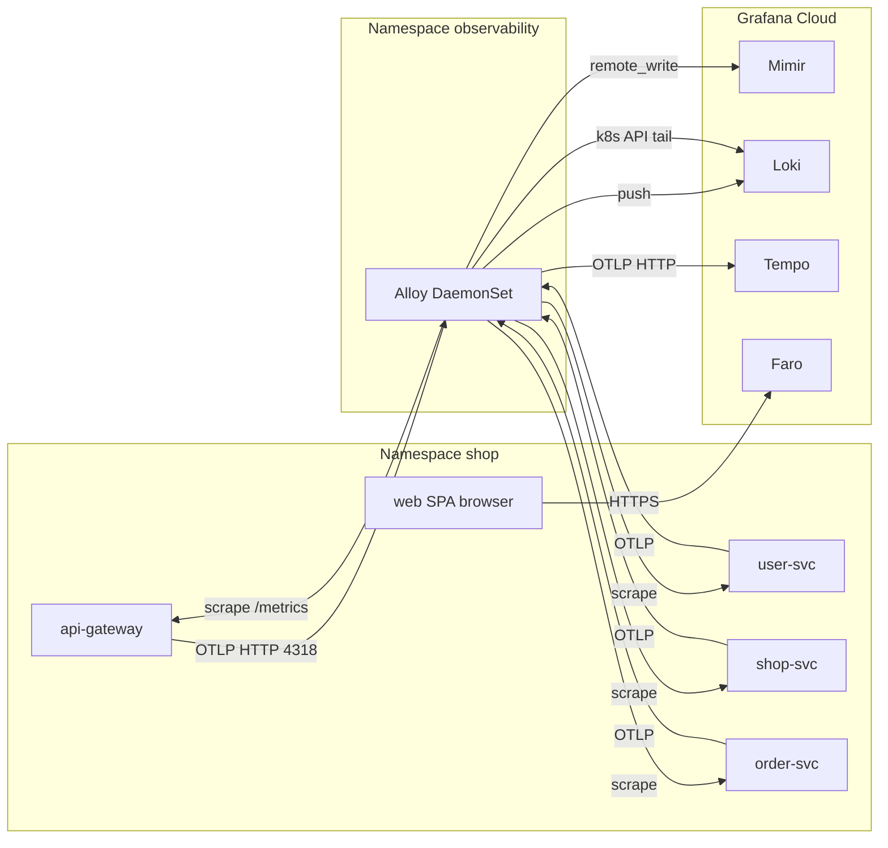

# Observability (LGTM + Faro)

This repo sends **metrics**, **logs**, and **traces** from the four NestJS services to **Grafana Cloud** via a single in-cluster **Grafana Alloy** DaemonSet. The React SPA sends **RUM** directly to Grafana Cloud Faro using runtime `/config.json`.

## Architecture



## Feature flags & secrets

| Gate | Purpose |
| ---- | ------- |
| `OTEL_EXPORTER_OTLP_ENDPOINT` | Base URL for traces (e.g. `http://alloy.observability.svc.cluster.local:4318`). When unset locally, tracing is off. |
| `OBS_ENABLED` | When `true`, warns if OTLP endpoint is missing (`registerTracing`). |
| `LOG_FORMAT=json` or `OBS_ENABLED=true` | Enables structured JSON logs via `nestjs-pino` (see `@shop/observability`). |
| Kubernetes Secret `grafana-cloud-credentials` | Mimir / Loki / Tempo credentials for Alloy (see `infra/k8s/observability/secrets.example.yaml`). |
| ConfigMap `web-runtime-config` → `/config.json` | Faro collector URL + optional app key (`infra/k8s/web.yaml`). |

## Label & metric conventions

- **HTTP**: histogram `shop_http_request_duration_seconds` with labels `method`, `route` (normalized), `status_code`. Do **not** add user IDs or session IDs as labels.
- **Business**: `checkout_published_total{transport,result}`, `orders_created_total{result}`, `order_checkout_handle_seconds{source}`, `kafka_consumer_lag_seconds` (gauge, Kafka path).
- **Sampling**: set `OTEL_TRACES_SAMPLER=parentbased_traceidratio` and `OTEL_TRACES_SAMPLER_ARG=0.1` on Deployments (done in `infra/k8s/*.yaml`). Alloy additionally applies tail sampling (~10% + errors) before Tempo.

## Runbook snippets

### Alloy unhealthy

```bash
kubectl -n observability logs daemonset/alloy --tail=200
kubectl -n observability describe pod -l app=alloy
```

Confirm Secret `grafana-cloud-credentials` exists and keys match `secrets.example.yaml`.

### No traces in Tempo

1. `kubectl -n shop exec deploy/api-gateway -- wget -qO- http://localhost:3000/metrics | head` — confirms pod metrics path.
2. From a shop pod: `wget -qO- http://alloy.observability.svc.cluster.local:4318` — TCP reachability (expect non-200 body; connection success matters).
3. Verify NetworkPolicy allows shop → alloy `:4318`.

### Faro not loading

1. Open `https://<your-ingress>/config.json` — must return JSON, `Cache-Control: no-store`.
2. Set `faroEnabled: true` and a valid `faroCollectorUrl` in ConfigMap `web-runtime-config`.

## Adding a new metric

1. Prefer factories in `packages/observability/src/business-metrics.ts` (or add a new exported series there with a small fixed label set).
2. `pnpm --filter @shop/observability build`
3. Import the series in the owning service and call `.inc()` / `startTimer()` at the business boundary.
4. Extend `infra/grafana/dashboards/business-checkout.json` and `infra/grafana/alerts.yaml` if operators need visibility.

## Adding a new alert

1. Add a rule group under `infra/grafana/alerts.yaml` using PromQL tested in Grafana **Explore → Mimir**.
2. Import or sync the file via your Grafana Cloud alerting workflow (manual first; Terraform later).

## E2E smoke (manual)

1. Deploy stack + Alloy + Grafana secret + `web-runtime-config` with Faro enabled.
2. Trigger a checkout from the SPA.
3. Within ~30–60s: Mimir — `rate(checkout_published_total[5m])`; Loki — JSON log line with `correlationId`; Tempo — trace for gateway span; Faro — session / view in Frontend Observability.

## References

- [`infra/k8s/observability/README.md`](../infra/k8s/observability/README.md) — Alloy River overview.
- [`docs/grafana-cloud-bootstrap.md`](./grafana-cloud-bootstrap.md) — credential names for Phase 0.
- [`infra/grafana/README.md`](../infra/grafana/README.md) — dashboards & alert files.
